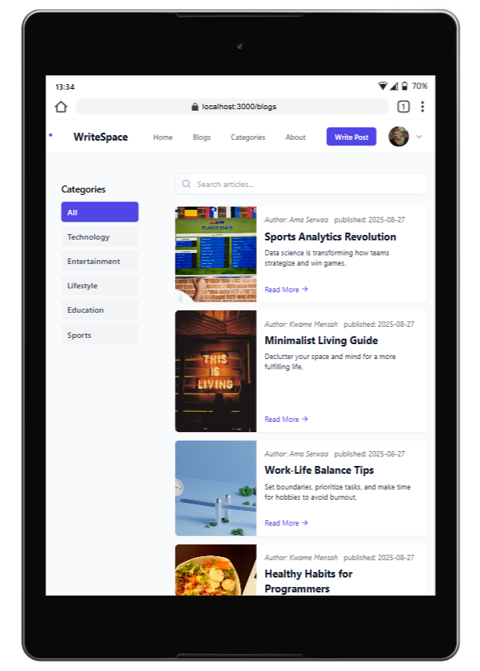
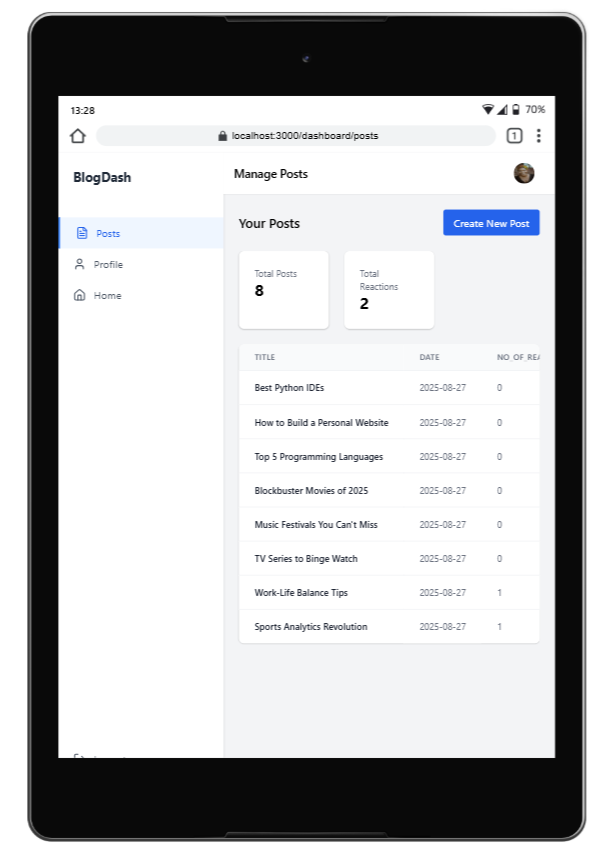

# Django + React Blog Website

A full-stack blog platform built with Django (backend) and React (frontend), featuring user authentication, post creation, category filtering, cursor-based pagination, and Docker support.

## Demo

### Blog Page



### Dashboard



### Home Page Video Demo

[](demo/home.webm)

---

## Features

- User registration, login, and profile management
- Create, edit, delete, and view blog posts
- Category-based post filtering and paginated listing
- Cursor pagination for efficient navigation
- RESTful API with Django REST Framework
- Responsive React frontend with search and category navigation
- Dockerized setup for easy development and deployment

## Technologies Used

- Django & Django REST Framework
- React
- SQLite (default, can be swapped for PostgreSQL)
- Docker
- Tailwind CSS (or your preferred CSS framework)

## Setup Instructions

### Backend (Django)

1. Install dependencies:
   ```bash
   pip install -r requirements.txt
   ```
2. Run migrations:
   ```bash
   python manage.py migrate
   ```
3. Create a superuser:
   ```bash
   python manage.py createsuperuser
   ```
4. Start the server:
   ```bash
   python manage.py runserver
   ```

### Frontend (React)

1. Install dependencies:
   ```bash
   cd frontend
   npm install
   ```
2. Start the development server:
   ```bash
   npm start
   ```

### Docker (Optional)

1. Build and run containers:
   ```bash
   docker-compose up --build
   ```

## API Endpoints (commonly used endpoints)

- `/api/blog/posts/` - Paginated list of all posts (cursor pagination)
- `/api/blog/category/<category_id>/posts/` - Paginated posts for a category
- `/api/blog/categories/` - List all categories
- `/api/blog/posts/new/` - Create a new post
- `/api/blog/posts/get/<id>/` - Retrieve, update, or delete a post
- `/api/users/profile/` - Get user profile

## Frontend Usage

- Browse posts by category or search by title
- Use pagination controls to navigate posts
- View post details, author info, and more
