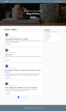

# Django Blog Project

Welcome to the Django Blog Project! This is a simple blog application built with Django, designed to allow users to create, read, update, and delete blog posts.

## Deployed Project

You can view the deployed project at: [https://jdonkor.pythonanywhere.com/](https://jdonkor.pythonanywhere.com)

## Features

- User authentication (registration, login, logout)
- Create, edit and delete blog posts
- View blog posts with pagination
- Update user profile
- Responsive design

## Technologies Used

- Python 3.x
- Django 3.x or later
- SQLite
- HTML/CSS
- Bootstrap (for styling)

### Prerequisites

Make sure you have Python and pip installed on your machine. You can download Python from [python.org](https://www.python.org/downloads/).

### Clone the Repository

git clone https://github.com/donkor-james/django-project.git

cd django-blog

### Set Up the Database

Run the following commands to set up the database:
bash
python manage.py migrate

### Create a Superuser

To access the admin panel, create a superuser:

bash
python manage.py createsuperuser

### Run the Development Server

You can now run the development server:

bash
python manage.py runserver

Visit http://127.0.0.1:8000/ in your web browser to see the blog in action! (make sure you have internet connection for boostrap CDN to work :) )

## Application Preview

## Usage

After setting up the project, you can:

- Register a new account and log in as a user.
- Create new blog posts
- Edit blog posts
- Update profile infomation
